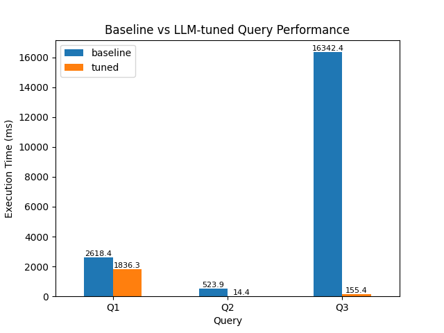

# Portfolio: Data Engineering Projects

This portfolio showcases my personal and academic projects related to **data engineering**, with a focus on database performance, automation, and scalable processing in cloud-simulated environments, and algorithmic optimisation for large-scale data processing.

## 1. Cloud-based Database Performance Benchmarking with LLM-assisted SQL Tuning

This project simulates enterprise-scale database performance engineering tasks in a cloud-like environment, using PostgreSQL, Docker, and Python for benchmarking and visualisation. It showcases how LLMs (ChatGPT) can assist in query tuning by suggesting rewrites and indexing strategies that improve performance.

### Goals
- Benchmark and optimise SQL queries in PostgreSQL
- Automate query benchmarking and log results with Python
- Apply LLM-assisted SQL tuning (via ChatGPT prompts) to generate query rewrites and indexing hints
- Visualise baseline vs tuned performance

### Tech Stack
- **Databases**: PostgreSQL  
- **Storage/Infra**: Docker, Ubuntu/WSL2  
- **Automation**: Python (psycopg2, pandas)
- **Visualisation**: matplotlib  
- **GenAI**: ChatGPT (LLM suggestions for query tuning)

### Folder structure
```sh
Cloud_DB_Performance_Engineering/
├── data/
│   └── raw/                      # Sample dataset (NYC Taxi: https://www.nyc.gov/site/tlc/about/tlc-trip-record-data.page)
├── ingestion/
│   ├── postgres_init.sql         # Create schemas & tables for Postgres
│   └── postgres_load.py          # Load data into Postgres
├── benchmarks/
│   ├── baseline_queries.sql      # Original queries
│   ├── tuned_queries.sql         # Rewrites suggested by ChatGPT + indexes
│   ├── run_benchmarks.py         # Execute queries, log timings
│   └── results.csv               # Benchmark logs (query, time_ms)
├── plots/
│   └── plot_results.py           # Plot the comparison results
├── docker-compose.yaml
├── requirements.txt
└── Makefile
```

### Workflow
1. **Data Ingestion** – Loaded raw NYC Taxi data (~3.5M rows, January 2025) into PostgreSQL
2. **Baseline Queries** – Run representative SQL queries, capture timings
3. **LLM-assisted Tuning** – Asked ChatGPT to improve baseline queries (e.g., change BETWEEN to half-open ranges, suggest composite indexes). Incorporated these into tuned_queries.sql.
4. **Benchmarking** – Ran both baseline and tuned queries via run_benchmarks.py, saving execution times to results.csv
5. **Visualisation** – Generated bar chart from results.csv with matplotlib (example_plot.png)

### Outcomes
- LLM suggested improvements such as:
  - Rewriting date filters from BETWEEN to half-open ranges for index efficiency
  - Adding a composite index (pu_location_id, tpep_pickup_datetime)
- Benchmarks were run on ~3.5M rows of data and showed significant runtime improvements (see `benchmarks/results.csv` for raw timings):
  - Q1: 57% faster (2.2s → 0.9s)
  - Q2: 98% faster (155ms → 4ms)
  - Q3: 98% faster (8.4s → 0.2s)

#### Visual Comparison


### Learnings
- Built a reproducible benchmarking setup with Docker + PostgreSQL
- Logged and visualised query performance with Python
- Showed a practical use of GenAI: leveraging ChatGPT as a SQL tuning assistant rather than writing tuned queries entirely by hand
- Identified possible future extensions, such as:
  - Integrating MinIO (S3-compatible object storage) to simulate cloud-based ingestion
  - Automating LLM-assisted query rewrites via a script

---


## 2. MSc Thesis Project – Inequality Join Optimisation

A research-driven project focused on improving the efficiency of inequality joins for interval-based data (e.g., time series or temporal ranges). Conducted as part of my Master's thesis.

### Overview
- Implemented and benchmarked multiple join algorithms in Python to study inequality and interval-overlap joins, which are common but performance-intensive in database systems
  - **Brute-force baseline**: naive nested loop across all tuples  
  - **IEJoin**: index-based inequality join using sorted arrays, permutation/offset arrays, and bitmap indexes
  - **RMJ (Range Merge Join)**: join based on scanning ranges for overlapping intervals  
  - **OMJ (Overlap Merge Join)**: symmetric extension of RMJ combining forward and backward scans
  - **Modified IEJoin**: two variants testing the impact of filtering order:
    - Index-first filtering (check r.idx > s.idx before interval conditions)
    - Interval-first filtering (check r.B < s.E ∧ r.E > s.B before index condition)
  - **Modified RMJ/OMJ**: adapted versions incorporating r.idx > s.idx before overlap checks, returning combined results
- Built a benchmarking framework to measure runtime across different dataset sizes (1k–10k rows) and overlap densities (10–90%+), analysing execution time, scalability, and trade-offs.


### Outcomes
- Showed that **algorithm performance depends heavily on overlap density** in interval datasets  
- **Modified IEJoin** was the most efficient under low to moderate overlap (≈10–50%)  
- **Brute-force join** (baseline) outperformed all others under very high overlap (>90%) due to minimal filtering overhead  
- **Modified RMJ/OMJ**, while theoretically efficient, underperformed than expected and in some cases slower than the baseline, revealing gaps for further optimisation
- **Modified IEJoin** showed that filtering order matters:
  - Interval-based filtering first (r.B < s.E ∧ r.E > s.B) was faster when overlaps were sparse or moderate (e.g., no overlap or ≈10–50%)
  - Index-based filtering first (r.idx > s.idx) was more efficient when most intervals overlapped (e.g., >90% or full overlap)
- Overall, the findings highlight the **need to adapt join strategy and filtering order to dataset characteristics**, with direct implications for optimising temporal and time-series queries


#### Visual Comparison

Performance comparison under different overlap conditions (n = 1k rows):  
- **Case 0:** No overlap
- **Case 1:** Full overlap
- **Case 2:** Partial overlap (10% and 90%)


### Folder structure
```sh
Thesis_Ineuqality_Join
├───Inequality_Join_Algo    # Core implementation of each join algorithm variant
├───Evaluation/             # Jupyter notebooks for performance experiments
│   └── src/                # Python scripts for data generation and benchmarking
└───Master_Thesis.pdf       # Full thesis with summary, processes and results
```