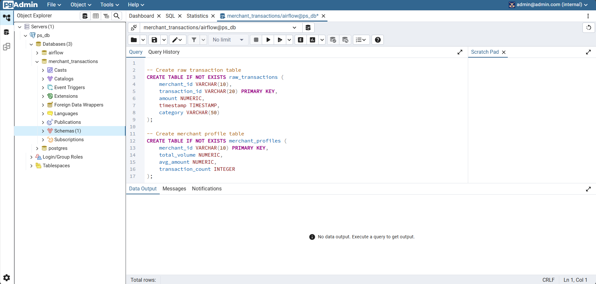
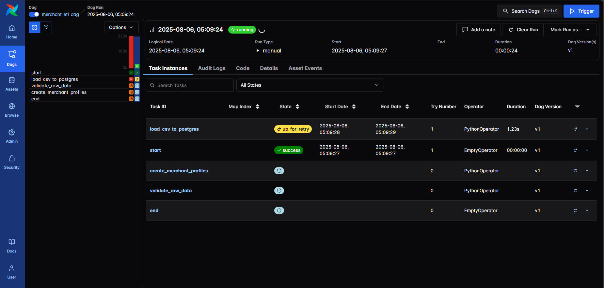

# Portfolio: Data Engineering Projects

This portfolio showcases my personal and academic projects related to **data engineering**, with a focus on data pipeline orchestration, automation, and algorithmic optimisation for large-scale data processing.


## 1. ETL Pipeline for Merchant Transactions using Apache Airflow

A self-contained project simulating a real-world ETL pipeline for merchant profiling, built with Apache Airflow, PostgreSQL, and Python. It showcases core concepts in DAG design, task orchestration, and pipeline modularity.

While the load_csv_to_postgres task is currently under debugging due to a SQLAlchemy engine compatibility issue, the overall DAG structure and PostgreSQL integration logic are complete and functional. Ongoing improvements include enhanced data validation and future dashboard integration.

### Goals
- Automate the ingestion, validation, and transformation of merchant transaction data
- Create summary-level merchant profiles
- Ensure data consistency and integrity
- Explore pipeline monitoring and modularisation


### Tech Stack
- **Tools**: Apache Airflow, PostgreSQL, Docker
- **Languages**: Python (pandas, psycopg2)
- **Dev Environment**: pgAdmin, Jupyter Notebook


### Pipeline Overview
1. **Extract:** raw CSV transaction data
2. **Validate:** using custom Python functions
3. **Transform:** into merchant profile metrics
4. **Load:** clean data into PostgreSQL tables


### Data Quality Checks
- Nulls, duplicates, timestamp validity
- Transaction amount sanity


### Screenshots


<!--  -->


### Learnings
- Designed DAG structures with robust task dependencies
- Integrated Airflow with PostgreSQL using hooks and connections
- Built validation logic to simulate real-world ETL quality assurance


### Folder structure
```sh
Project_Airflow/
├───dags/               # Core ETL logic (load, validate, transform)
│   └───data/           # Toy data for simulation
└───screenshots/        # DAG UI and result snapshots
```
Note: Depending on the xxx, visualisation part will be added.

---


## 2. MSc Thesis Project – Inequality Join Optimisation

A research-driven project focused on improving the efficiency of inequality joins for interval-based data with indexes (e.g., time series or temporal ranges). This work was submitted as part of my Master's thesis in Data Science at the University of Zurich.


### Overview
- Designed and implemented multiple inequality join algorithms
  - **Brute-force**: A naive nested loop implementation evaluating all possible pairs for three inequality predicates
  - **IEJoin**: An efficient inequality join algorithm using sorted indices to evaluate multiple predicates with reduced complexity
  - **RMJ (Range Merge Join)**: A join algorithm that scans sorted relations in a single direction (forward or backward) to efficiently return tuple pairs with overlapping intervals, based on inequality and overlap conditions
  - **OMJ (Overlap Merge Join)**: An extended version of RMJ that performs both forward and backward scans by executing RMJ twice with swapped input relations, effectively capturing the full symmetric overlap between tuples
- Conducted performance evaluation using Python to compare brute-force, interval-based filtering, and index-based filtering across varying data sizes and interval overlap ratios


### Folder structure
```sh
Thesis_Ineuqality_Join
├───Inequality_Join_Algo    # Core implementation of each join algorithm variant
├───Evaluation/             # Jupyter notebooks for performance experiments
│   └── src/                # Python scripts for data generation and benchmarking
└───Master_Thesis.pdf       # Full thesis with summary, processes and results
```