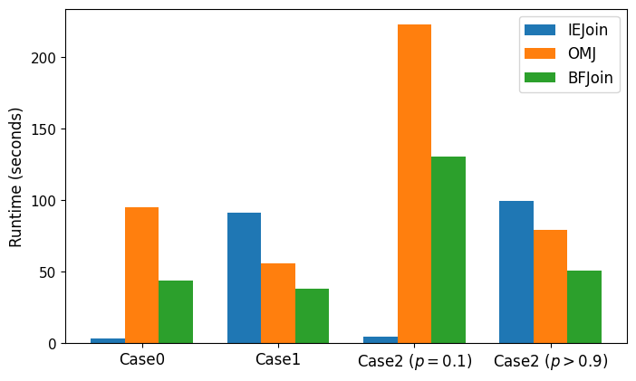

## MSc Thesis Project – Inequality Join Optimisation

A research-driven project focused on improving the efficiency of inequality joins for interval-based data (e.g., time series or temporal ranges). Conducted as part of my Master's thesis.

### Overview
- Implemented and benchmarked multiple join algorithms in Python to study inequality and interval-overlap joins, which are common but performance-intensive in database systems
  - **Brute-force baseline**: naive nested loop across all tuples  
  - **IEJoin**: index-based inequality join using sorted arrays, permutation/offset arrays, and bitmap indexes
  - **RMJ (Range Merge Join)**: join based on scanning ranges for overlapping intervals  
  - **OMJ (Overlap Merge Join)**: symmetric extension of RMJ combining forward and backward scans
  - **Modified IEJoin**: two variants testing the impact of filtering order:
    - Index-first filtering (check r.idx > s.idx before interval conditions)
    - Interval-first filtering (check r.B < s.E ∧ r.E > s.B before index condition)
  - **Modified RMJ/OMJ**: adapted versions incorporating r.idx > s.idx before overlap checks, returning combined results
- Built a benchmarking framework to measure runtime across different dataset sizes (1k–10k rows) and overlap densities (10–90%+), analysing execution time, scalability, and trade-offs.


### Outcomes
- Showed that **algorithm performance depends heavily on overlap density** in interval datasets  
- **Modified IEJoin** was the most efficient under low to moderate overlap (≈10–50%)  
- **Brute-force join** (baseline) outperformed all others under very high overlap (>90%) due to minimal filtering overhead  
- **Modified RMJ/OMJ**, while theoretically efficient, underperformed than expected and in some cases slower than the baseline, revealing gaps for further optimisation
- **Modified IEJoin** showed that filtering order matters:
  - Interval-based filtering first (r.B < s.E ∧ r.E > s.B) was faster when overlaps were sparse or moderate (e.g., no overlap or ≈10–50%)
  - Index-based filtering first (r.idx > s.idx) was more efficient when most intervals overlapped (e.g., >90% or full overlap)
- Overall, the findings highlight the **need to adapt join strategy and filtering order to dataset characteristics**, with direct implications for optimising temporal and time-series queries


#### Visual Comparison
<br/>
Performance comparison under different overlap conditions (n = 1k rows):  
- **Case 0:** No overlap
- **Case 1:** Full overlap
- **Case 2:** Partial overlap (10% and 90%)


### Folder structure
```sh
Thesis_Ineuqality_Join
├───Inequality_Join_Algo    # Core implementation of each join algorithm variant
├───Evaluation/             # Jupyter notebooks for performance experiments
│   └── src/                # Python scripts for data generation and benchmarking
└───Master_Thesis.pdf       # Full thesis with summary, processes and results
```